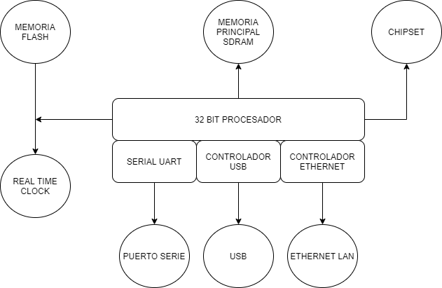

# Sistema embebidos

## :trophy: C0.4 Reto en clase

Investigación sobre los tipos de sistema embebidos y adquisición de datos

___

## Instrucciones

- Realizar una investigación sobre dos tipos de sistemas embebidos y adquisición de datos, respondiendo a las preguntas que se plantean en la sesión de desarrollo.
- Toda actividad o reto se deberá realizar utilizando el estilo **MarkDown con extension .md** y el entorno de desarrollo VSCode, debiendo ser elaborado como un documento **single page**, es decir si el documento cuanta con imágenes, enlaces o cualquier documento externo debe ser accedido desde etiquetas y enlaces.
- Es requisito que el archivo .md contenga una etiqueta del enlace al repositorio de su documento en Github, por ejemplo **Enlace a mi GitHub**
- Al concluir el reto el reto se deberá subir a github el archivo .md creado.
- Desde el archivo **.md** se debe exportar un archivo **.pdf** con la nomenclatura **C0.4_NombreAlumno_Equipo.pdf**, el cual deberá subirse a classroom dentro de su apartado correspondiente, para que sirva como evidencia de su entrega; siendo esta plataforma **oficial** aquí se recibirá la calificación de su actividad por individual.
- Considerando que el archivo .pdf, fue obtenido desde archivo .md, ambos deben ser idénticos y mostrar el mismo contenido.
- Su repositorio ademas de que debe contar con un archivo **readme**.md dentro de su directorio raíz, con la información como datos del estudiante, equipo de trabajo, materia, carrera, datos del asesor, e incluso logotipo o imágenes, debe tener un apartado de contenidos o indice, los cuales realmente son ligas o **enlaces a sus documentos .md**, _evite utilizar texto_ para indicar enlaces internos o externo.
- Se propone una estructura tal como esta indicada abajo, sin embargo puede utilizarse cualquier otra que le apoye para organizar su repositorio.

  
```
| readme.md
| | blog
| | | C0.1_x.md
| | | C0.2_x.md
| | | C0.3_x.md
| | | C0.4_x.md
| | img
| | | x.drawio.png
| | | y.drawio.png
| | docs
| | | A0.1_x.md
| | | A0.2_x.md
```
___

## :pencil2:  Desarrollo

1. Instale la extension Draw.io integration dentro de visual studio code y elabore el diagrama solicitado.
    
2. Apoyado de la información mostrada por el asesor, una investigación, responder a lo siguiente:

- **Sistema embebido**:

  - Definición de un sistema embebido
    R: Un Sistema Embebido es un sistema electrónico diseñado para realizar pocas funciones en tiempo real, según sea el caso. Al contrario de lo que ocurre con las computadoras, las cuales tienen un propósito general, ya que están diseñadas para cubrir un amplio rango de necesidades y los Sistemas Embebidos se diseñan para cubrir necesidades específicas. 

  - Tipo de tecnologías que se pueden involucrar para desarrollar un sistema embebido.
    R: Java y arduino.

  - Elabore un ilustración que apoye a explicar un mapa de ruta a seguir para crear una arquitectura para un sistema embebido
    R: 

- **Sistema de adquisición de datos**:

  - Definición de un sistema de adquisición de datos. R: Una base de datos embebida es un sistema de gestión de bases de datos (SGBD) que está integrado con la aplicación software que requiere acceso a los datos almacenados, de tal forma que la base de datos está oculta de la aplicación de usuario final y requiere poco o ningún mantenimiento.
  - 
  - Tipo de tecnologías que se pueden involucrar para desarrollar un sistema de adquisición de datos. R:SQLite, SQLserver, firebird Embedded,
    Mongo DS.

  - Elabore un ilustración que apoye a explicar un mapa de ruta a seguir para crear una arquitectura para un sistema de adquisición de datos.

- **Caso de éxito**

  - De acuerdo con el video mostrado, explique que ha permitido la innovación tecnológica a la empresa lograr?
    R: Conocer y manejar el viñedo de una manera rapida y precisa, la tecnologia aporta la informacion para el conocimiento del comportamiento
    de la planta y asi producir el mejor vino
    .
  - Que tipos de sistemas ha implantado Vodafone al caso de estudio indicado en el video?
    R: Sistema satelital y sistema sensores en el campo para mnitorear estaciones climaticas.

  - Que tecnologías se observan en este caso de éxito?
    R: Geolocalizacion de ciertas areas en donde se puede determinar efermedades en la planta, eficiencia solar la humedad y el estado de estas, 
    la infomracion es mandada al
    encargado para su respectivo analisis.

1. Coloque aquí la ilustración elaborada para el **sistema embebido**
   
2. Coloque aquí la ilustración elaborada para el **sistema de adquisición de datos**
   
___

### :bomb: Rubrica

| Criterios     | Descripción                                                                                  | Puntaje |
| ------------- | -------------------------------------------------------------------------------------------- | ------- |
| Instrucciones | Se cumple con cada uno de los puntos indicados dentro del apartado Instrucciones?            | 20 |
| Desarrollo    | Se respondió a cada uno de los puntos solicitados dentro del desarrollo de la actividad?     | 80      |

   
:house: [Ir a mi repositorio GitHub](https://github.com/abraham22rodriguez/AnalisisAvanzadoDeSoftware_AbrahamRodriguez.git)